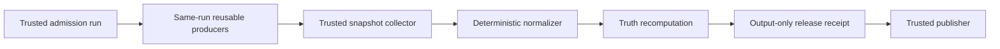

# CI Authority

This guide owns BCF's provider-backed certification model and GitHub reference
topology. [Architecture](ARCHITECTURE.md) explains the broader design;
[Using BCF](USAGE.md) owns adoption commands and routine operation.

## State flow

Admission authenticates the repository, workflow identity, event, and exact
candidate commit before assigning a totally ordered ordinal. Producers execute
candidate code on fresh workers. A trusted collector reconstructs provider
state from authenticated APIs; callback payloads are hints, not authority. A
normalizer produces the certification report, and truth independently
recomputes it with ordinary gate receipts and the evidence-session manifest.

Only after a passing computation does truth emit a schema-2 release receipt.
That receipt is outside the truth input directory and cannot help prove itself.
Publication consumes the receipt and certified artifacts downstream.

## Trust table

| Role | Executes candidate code | Credentials | Permitted effects |
|---|---:|---|---|
| Admission controller | No | Read provider state; closed dispatch authority | Admit an exact subject and dispatch owned producers |
| Candidate worker | Yes, on a fresh disposable worker | Minimal read-only token | Produce declared artifacts for one job |
| Snapshot collector/finalizer | No | Read provider state and controller artifacts | Normalize one admission's authenticated state |
| Status publisher | No | Status write only | Publish deterministic status precedence |
| Release builder | Yes, on a fresh hosted worker | Read-only source and closed wheelhouse | Emit untrusted distributions and raw logs |
| Release verifier | Yes, on a different fresh hosted worker | Read-only build and wheelhouse artifacts | Recompute dependency, archive, install, test, hash, and Twine results |
| Release collector | No | Read provider state and hash artifacts | Emit the sole authoritative release receipt |
| Release publisher | No | Artifact read, attestation, release write | Publish the already-certified exact bytes |

Candidate jobs cannot dispatch or cancel runs, write status, emit authoritative
callbacks, access trusted or sibling secrets, retain checkout credentials, or
reach persistent host-control sockets and workspaces. Trusted jobs check out no
candidate code, execute no candidate-provided script, and do not interpolate
candidate strings into shell commands.

## Workflow identity and admission

Authority binds provider and numeric repository ID, numeric workflow ID,
active path, trusted default-main workflow blob and SHA-256, definition commit,
event, run ID, attempt, candidate commit, and candidate tree. Run names, job
display names, and display titles are presentation only. Descriptive names help
operators; stable IDs remain the mechanical interface.

Authority contract v1.1 adds one canonical workflow registry. Privileged roles
refer to entries in that registry; missing numeric IDs, paths, definition
commits, blob OIDs, or SHA-256 pins fail closed. Version 1.0 remains readable,
but it cannot support new exact-main or release claims.

The serialized trusted control plane mints an opaque admission ordinal. The
GitHub adapter maps it to control-plane run ID, run attempt, and closed dispatch
sequence. The highest admitted ordinal wins; within a producer run, the highest
attempt wins. A later admitted terminal failure revokes an earlier success.
Unadmitted manual runs cannot suppress authority, and a moved default-main head
makes earlier exact-main work obsolete. In v1.1, reusable producer membership
also binds repository, commit, tree, admission run and attempt, dispatch
sequence, producer, referenced-workflow path and SHA, and the exact job
inventory. Producers cannot be borrowed from another same-SHA run.

## GitHub reference topology

The v1.1 topology uses one exact-main push admission whose jobs call the
governance and package workflows at the admitted SHA. The finalizer reads only
that run and exact attempt; a separate publisher applies the canonical status
precedence. It has no polling, sleeping, capacity waiter, or hosted VM
allocated only to wait for another runner. Candidate jobs use fresh standard
hosted runners. Persistent self-hosted runners are reserved for short trusted
control-plane work and never check out candidate code.

The topology is disabled until explicitly adopted and activated. Adoption is a
transaction and preserves unrelated workflow bytes. Numeric workflow IDs and
trusted default-main blob identities are pinned only after the structural
workflows exist on main.

`GITHUB_TOKEN` recursion rules are handled through closed workflow and callback
events; a `repository_dispatch` payload alone carries no authority. Each
callback re-queries current workflow, run, job, and artifact state through the
provider API. Exact run and attempt namespaces prevent a rerun from consuming
an earlier attempt's terminal artifact.

## Release construction and publication

Release inputs are closed for Ubuntu 24.04, CPython 3.12.14, Linux x86-64, and
pytest 9.0.3. The committed lock and wheelhouse manifest name every direct and
transitive version, wheel filename, SHA-256, interpreter/platform identity,
and lock digest. Build and verification use only that wheelhouse with
`--no-index --require-hashes`; build isolation and range resolution are not
release inputs.

An owner dispatch starts a short no-checkout authorization job. A fresh hosted
builder receives that authorization, checks out exact certified main without
credentials, and emits untrusted distributions, checksums, logs, JUnit, and a
manifest. A separate fresh, secretless hosted verifier authenticates the build
artifact, rejects unsafe archives, installs and tests the exact wheel and
extracted sdist from the closed wheelhouse, runs Twine, and emits raw results.
A no-checkout trusted collector then re-authenticates every run, attempt,
workflow, provider artifact digest, controller identity, dependency closure,
commit, tree, and asset hash. Only that collector may emit the schema-2 release
receipt; the receipt is never an input to its own construction.

Publication is separate. Immutable releases must already be enabled. The
publisher authenticates an annotated unsigned tag at the certified commit,
creates a draft, attaches and attests only the certified wheel, sdist, and
checksums, verifies their provider digests, and publishes the draft. It never
rebuilds. Published tags and releases are not rewritten; a defect advances the
patch version.

The stricter boundary adds control-plane configuration and artifact custody.
It reduces the chance that persistent candidate state, a misleading check name,
or a stale successful attempt can become release authority; it does not remove
the need to secure maintainer accounts and repository settings.
