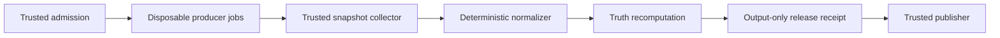

# CI Authority

This guide owns BCF's provider-backed certification model and GitHub reference
topology. [Architecture](ARCHITECTURE.md) explains the broader design;
[Using BCF](USAGE.md) owns adoption commands and routine operation.

## State flow

Admission authenticates the repository, workflow identity, event, and exact
candidate commit before assigning a totally ordered ordinal. Producers execute
candidate code on fresh workers. A trusted collector reconstructs provider
state from authenticated APIs; callback payloads are hints, not authority. A
normalizer produces the certification report, and truth independently
recomputes it with ordinary gate receipts and the evidence-session manifest.

Only after a passing computation does truth emit a schema-2 release receipt.
That receipt is outside the truth input directory and cannot help prove itself.
Publication consumes the receipt and certified artifacts downstream.

## Trust table

| Role | Executes candidate code | Credentials | Permitted effects |
|---|---:|---|---|
| Admission controller | No | Read provider state; closed dispatch authority | Admit an exact subject and dispatch owned producers |
| Candidate worker | Yes, on a fresh disposable worker | Minimal read-only token | Produce declared artifacts for one job |
| Snapshot collector/finalizer | No | Read provider state and artifacts | Normalize authenticated state and emit a closed callback |
| Status publisher | No | Status write only | Publish deterministic status precedence |
| Release publisher | No | Artifact read, attestation, release write | Verify and publish pre-certified exact bytes |

Candidate jobs cannot dispatch or cancel runs, write status, emit authoritative
callbacks, access trusted or sibling secrets, retain checkout credentials, or
reach persistent host-control sockets and workspaces. Trusted jobs check out no
candidate code, execute no candidate-provided script, and do not interpolate
candidate strings into shell commands.

## Workflow identity and admission

Authority binds provider and numeric repository ID, numeric workflow ID,
active path, trusted default-main workflow blob and SHA-256, definition commit,
event, run ID, attempt, candidate commit, and candidate tree. Run names, job
display names, and display titles are presentation only. Descriptive names help
operators; stable IDs remain the mechanical interface.

The serialized trusted control plane mints an opaque admission ordinal. The
GitHub adapter maps it to control-plane run ID, run attempt, and closed dispatch
sequence. The highest admitted ordinal wins; within a producer run, the highest
attempt wins. A later admitted terminal failure revokes an earlier success.
Unadmitted manual runs cannot suppress authority, and a moved default-main head
makes earlier exact-main work obsolete.

## GitHub reference topology

The generated topology uses an input-free exact-main kickoff, exact-SHA
producer fanout, a trusted `workflow_run` finalizer, and a trusted status
publisher. It has no polling, sleeping, capacity waiter, or hosted VM allocated
only to wait for another runner. Candidate jobs use fresh standard hosted
runners by default. Persistent self-hosted runners are reserved for short
trusted control-plane work and never check out candidate code.

The topology is disabled until explicitly adopted and activated. Adoption is a
transaction and preserves unrelated workflow bytes. Numeric workflow IDs and
trusted default-main blob identities are pinned only after the structural
workflows exist on main.

`GITHUB_TOKEN` recursion rules are handled through closed workflow and callback
events; a `repository_dispatch` payload alone carries no authority. Each
callback re-queries current workflow, run, job, and artifact state through the
provider API. Exact run and attempt namespaces prevent a rerun from consuming
an earlier attempt's terminal artifact.

## Release construction and publication

An owner dispatch on exact main authenticates the latest certified callback,
then a fresh candidate worker builds and tests the wheel and sdist. Truth binds
their digests into an output-only release receipt. No tag exists yet.

After that run succeeds, the owner creates one annotated tag at the exact
certified merge commit. The trusted tag publisher checks out no repository
code. It authenticates the annotated tag, selects the latest completed
exact-main release run and requires it to be successful, verifies the Actions
artifact digest, rejects unsafe archive paths and symlinks, verifies the
receipt and `SHA256SUMS`, attests those exact files, and creates the GitHub
release. It performs no rebuild.

The stricter boundary adds control-plane configuration and artifact custody.
It reduces the chance that persistent candidate state, a misleading check name,
or a stale successful attempt can become release authority; it does not remove
the need to secure maintainer accounts and repository settings.
