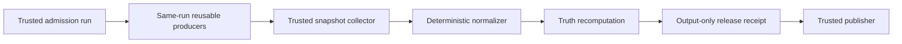

# CI Authority

This guide owns BCF's provider-backed certification model and GitHub reference
topology. [Architecture](ARCHITECTURE.md) explains the broader design;
[Using BCF](USAGE.md) owns adoption commands and routine operation.

## State flow

Admission authenticates the repository, workflow identity, event, and exact
candidate commit before assigning a totally ordered ordinal. Producers execute
candidate code on fresh workers. A trusted collector reconstructs provider
state from authenticated APIs; callback payloads are hints, not authority. A
normalizer produces the certification report, and truth independently
recomputes it with ordinary gate receipts and the evidence-session manifest.

Only after a passing computation does truth emit a schema-2 release receipt.
That receipt is outside the truth input directory and cannot help prove itself.
Publication consumes the receipt and certified artifacts downstream.

## Trust table

| Role | Executes candidate code | Credentials | Permitted effects |
|---|---:|---|---|
| Admission controller | No | Read provider state; closed dispatch authority | Admit an exact subject and dispatch owned producers |
| Candidate worker | Yes, on a fresh disposable worker | Minimal read-only token | Produce declared artifacts for one job |
| Snapshot collector/finalizer | No | Read provider state and controller artifacts | Normalize one admission's authenticated state |
| Status publisher | No | Status write only | Publish deterministic status precedence |
| Release builder | Yes, on a fresh hosted worker | Read-only source and closed wheelhouse | Emit untrusted distributions and raw logs |
| Release verifier | Yes, on a different fresh hosted worker | Read-only build and wheelhouse artifacts | Recompute dependency, archive, install, test, hash, and Twine results |
| Release collector | No | Read provider state and hash artifacts | Emit the sole authoritative release receipt |
| Release publisher | No | Artifact read, attestation, release write | Publish the already-certified exact bytes |
| Automation changelog reconciler | No | Provider read plus repository-scoped App contents write | Commit one fixed, path-derived changelog entry to an authenticated automation branch |

Candidate jobs cannot dispatch or cancel runs, write status, emit authoritative
callbacks, access trusted or sibling secrets, retain checkout credentials, or
reach persistent host-control sockets and workspaces. Trusted jobs check out no
candidate code, execute no candidate-provided script, and do not interpolate
candidate strings into shell commands.

## Automation-authored pull requests

The universal changelog rule also applies to dependency bots and registered
GitHub Apps. Repositories may explicitly adopt
`governance/automation-producers.yml`. A metadata-only admission authenticates
the numeric provider actor, same-repository branch, and mechanically derived
dependency paths. A separate protected-environment reconciler ignores PR prose,
constructs one fixed changelog entry and idempotence marker, then performs a
single-parent compare-and-swap ref update without force.

The writer App has contents-write authority only. It cannot approve or merge a
PR, publish certification, administer the repository, or execute candidate
code. The trusted PR finalizer reconstructs the latest exact-head governance
and package attempts; a separate publisher is the sole owner of
`bcf/pr-certification`. Newer pending, failed, cancelled, stale, or malformed
work revokes an older success. This deterministic service authority does not
delegate judgment to an AI agent.

## Workflow identity and admission

Authority binds provider and numeric repository ID, numeric workflow ID,
active path, trusted default-main workflow blob and SHA-256, definition commit,
event, run ID, attempt, candidate commit, and candidate tree. Run names, job
display names, and display titles are not authority when supplied by an operator
or callback. Committed workflow source job keys, literal matrices, and display-name
templates mechanically compile the exact provider job inventory; the authenticated
provider result must match that compiled inventory. Descriptive names help operators,
while Git and provider identities remain the authority.

Authority contract v1.1 adds one canonical workflow registry. Privileged roles
refer to entries in that registry; missing numeric IDs, paths, definition
commits, blob OIDs, or SHA-256 pins fail closed. Version 1.0 remains readable,
but it cannot support new exact-main or release claims.

The serialized trusted control plane mints an opaque admission ordinal. The
GitHub adapter maps it to control-plane run ID, run attempt, and closed dispatch
sequence. The highest admitted ordinal wins; within a producer run, the highest
attempt wins. A later admitted terminal failure revokes an earlier success.
Unadmitted manual runs cannot suppress authority, and a moved default-main head
makes earlier exact-main work obsolete. In v1.1, reusable producer membership
also binds repository, commit, tree, admission run and attempt, dispatch
sequence, producer, referenced-workflow path and SHA, and the exact job
inventory. Producers cannot be borrowed from another same-SHA run.

No probabilistic operator constructs these bindings. Git derives workflow blobs,
definition commits, and content digests. The provider API derives repository,
workflow, run, attempt, job, and artifact identities. Downloaded bytes derive package
digests. Deterministic code combines those observations under the declared policy and
causal controls prove that each mismatch fails. A maintainer or AI may propose policy,
review a change, and decide whether to merge or publish; neither may substitute a
copied value or judgment for the computation.

Authority v1.1 has a narrow self-hosting compatibility state. Its base registry,
admission jobs, and producer inventories remain readable by a pre-enrichment v1.1
controller while a successor controller is built. Privileged workflow job inventories
are absent in that state, so canary and release operations that require them fail
closed. After the successor is installed, the authority compiler projects the enriched
job inventories and preflight makes them exact; an identical tree or operator assertion
cannot skip that transition.

## GitHub reference topology

The v1.1 topology uses one exact-main push admission whose jobs call the
governance and package workflows at the admitted SHA. The finalizer reads only
that run and exact attempt; a separate publisher applies the canonical status
precedence. It has no polling, sleeping, capacity waiter, or hosted VM
allocated only to wait for another runner. Candidate jobs use fresh standard
hosted runners. Persistent self-hosted runners are reserved for short trusted
control-plane work and never check out candidate code.

The topology is disabled until explicitly adopted and activated. Adoption is a
transaction and preserves unrelated workflow bytes. Numeric workflow IDs and
trusted default-main blob identities are pinned only after the structural
workflows exist on main.

`GITHUB_TOKEN` recursion rules are handled through closed workflow and callback
events; a `repository_dispatch` payload alone carries no authority. Each
callback re-queries current workflow, run, job, and artifact state through the
provider API. Exact run and attempt namespaces prevent a rerun from consuming
an earlier attempt's terminal artifact.

The reference topology is rendered from `governance/ci-graph.yml` and its
registered extensions. The graph owns orchestration; this authority model owns
provider identity, admission, state precedence, and certification. Keeping
those responsibilities separate prevents a workflow renderer from inventing
release authority and prevents the authority controller from becoming a second
workflow-topology owner. Generated workflow bytes must pass graph parity first
and exact committed-workflow pinning second.

## Release construction and publication

Release inputs are closed for Ubuntu 24.04, CPython 3.12.14, Linux x86-64, and
pytest 9.0.3. The committed lock and wheelhouse manifest name every direct and
transitive version, wheel filename, SHA-256, interpreter/platform identity,
and lock digest. Build and verification use only that wheelhouse with
`--no-index --require-hashes`; build isolation and range resolution are not
release inputs.

An owner dispatch starts a short no-checkout authorization job. A fresh hosted
builder receives that authorization, checks out exact certified main without
credentials, and emits untrusted distributions, checksums, logs, JUnit, and a
manifest. A separate fresh hosted runtime job installs and tests the exact wheel and
extracted sdist from the closed wheelhouse, runs Twine, and emits raw results. A second
fresh hosted job authenticates provider custody and recomputes hashes without executing
candidate code. The short-lived read token used by pinned artifact-download steps is
never passed to candidate processes; no long-lived repository or sibling secret is used.
A provider-authenticated read of exact-main binds the lock and wheelhouse-manifest
blob OIDs and hashes before candidate work starts. The verifier uses separate controller
operations on distinct fresh machines: a token-free runtime operation owns offline
install/test/Twine execution and hashes every raw output, then a non-executing
token-bearing operation authenticates provider state and those results. Candidate
processes inherit a closed environment with
no provider token, credential, or runner-authority variable. Workflow shell and candidate
JSON cannot assert that verification passed.
A no-checkout trusted collector then re-authenticates every run, attempt,
workflow, provider artifact digest, controller identity, dependency closure,
commit, tree, and asset hash. Only that collector may emit the schema-2 release
receipt; the receipt is never an input to its own construction.
Release assets and runtime evidence are selected from controller-owned directory
contracts, so adding, omitting, renaming, or escaping a file fails without a hand-kept
shell argument list.

Publication is separate. Immutable releases must already be enabled. The
publisher authenticates an annotated unsigned tag at the certified commit,
creates a draft, attaches and attests only the certified wheel, sdist, and
checksums, verifies their provider digests, and publishes the draft. It never
rebuilds. Repository immutable-release inspection requires Administration read,
so the trusted publisher uses a short-lived explicitly declared credential for
that operation and publication; the ordinary workflow token remains the artifact
resolution credential. Published tags and releases are not rewritten; a defect
advances the patch version.

The stricter boundary adds control-plane configuration and artifact custody.
It reduces the chance that persistent candidate state, a misleading check name,
or a stale successful attempt can become release authority; it does not remove
the need to secure maintainer accounts and repository settings.
